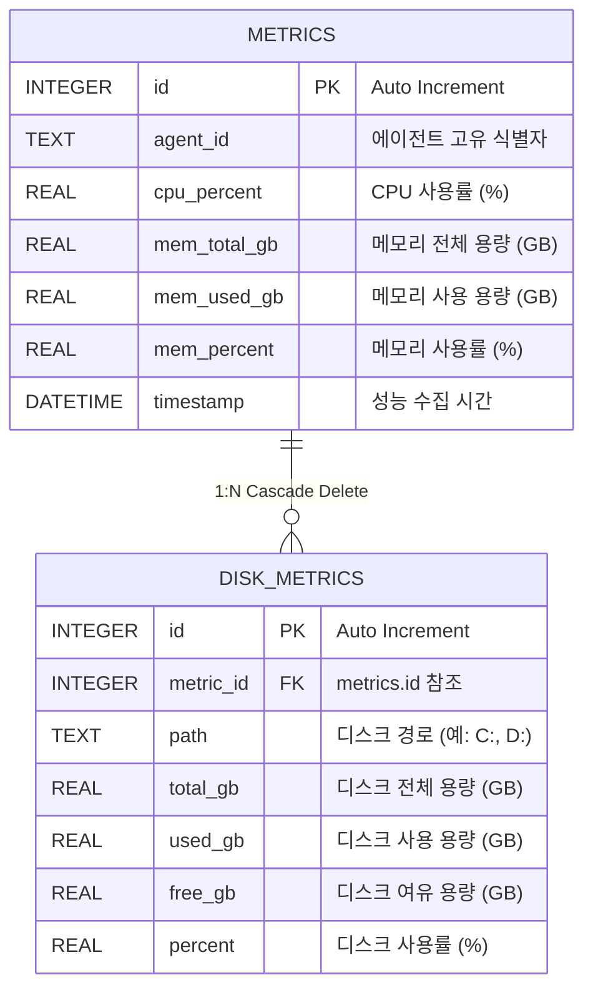

# [데이터베이스 명세서] go-watchdog 모니터링 DB

`go-watchdog` 서버는 초경량 서버 상태 관제를 위해 단일 파일 형태의 내장형 데이터베이스인 **SQLite3**를 사용합니다.

---

## 1. 데이터베이스 개요

* **파일명:** `monitoring.db` (실행 인자 `-db`를 통해 파일 경로 변경 가능)
* **저장소 위치:** 서버 실행 파일(`server.exe`) 구동 디렉토리 기준
* **데이터베이스 최적화 설정 (Pragmas):**
  * `journal_mode = WAL`: Write-Ahead Logging 모드를 사용하여 동시 쓰기/읽기 작업 시의 데이터 베이스 락(Lock)을 방지하고 성능을 극대화합니다.
  * `foreign_keys = ON`: 외래 키 제약 조건을 활성화하여 부모 데이터가 삭제될 때 자식 데이터도 함께 연쇄 삭제(`ON DELETE CASCADE`)되도록 합니다.
  * `busy_timeout = 5000`: 동시성 트랜잭션 충돌 시 최대 5초간 대기 후 에러를 반환하여 안전성을 높입니다.

---

## 2. 테이블 관계도 (ERD)



---

## 3. 테이블 상세 명세

### 3.1 `metrics` 테이블
서버(에이전트)로부터 수집된 시스템 전반의 핵심 자원 메트릭을 저장하는 메인 테이블입니다.

| 컬럼명 | 데이터 타입 | 제약 조건 | 설명 |
| :--- | :--- | :--- | :--- |
| **`id`** | `INTEGER` | `PRIMARY KEY`, `AUTOINCREMENT` | 메트릭 고유 레코드 ID |
| **`agent_id`** | `TEXT` | `NOT NULL` | 감시 대상 에이전트 고유 식별자 (예: `windows-db-server-01`) |
| **`cpu_percent`** | `REAL` | `NOT NULL` | 전체 CPU 사용률 (%) |
| **`mem_total_gb`** | `REAL` | `NOT NULL` | 시스템 전체 물리 메모리 용량 (GB) |
| **`mem_used_gb`** | `REAL` | `NOT NULL` | 시스템 현재 사용 메모리 용량 (GB) |
| **`mem_percent`** | `REAL` | `NOT NULL` | 시스템 메모리 사용률 (%) |
| **`timestamp`** | `DATETIME` | `NOT NULL` | 성능 메트릭이 수집된 시각 |

* **인덱스 (Indexes):**
  * `idx_metrics_agent_timestamp` (복합 인덱스): `(agent_id, timestamp)` 컬럼 기준 정렬 인덱스. 에이전트별 최신 상태를 빠르게 폴링 조회하기 위해 사용됩니다.

---

### 3.2 `disk_metrics` 테이블
각 감시 대상 서버가 가진 디스크 파티션(드라이브)별 용량 상태를 저장하는 하위 테이블입니다. `metrics` 테이블과 1:N 관계를 맺습니다.

| 컬럼명 | 데이터 타입 | 제약 조건 | 설명 |
| :--- | :--- | :--- | :--- |
| **`id`** | `INTEGER` | `PRIMARY KEY`, `AUTOINCREMENT` | 디스크 메트릭 고유 레코드 ID |
| **`metric_id`** | `INTEGER` | `NOT NULL`, `FOREIGN KEY` | `metrics.id` 참조 (`ON DELETE CASCADE`) |
| **`path`** | `TEXT` | `NOT NULL` | 디스크 볼륨 마운트 경로 (예: `C:`, `D:`) |
| **`total_gb`** | `REAL` | `NOT NULL` | 디스크 전체 크기 (GB) |
| **`used_gb`** | `REAL` | `NOT NULL` | 디스크 사용 크기 (GB) |
| **`free_gb`** | `REAL` | `NOT NULL` | 디스크 남은 여유 크기 (GB) |
| **`percent`** | `REAL` | `NOT NULL` | 디스크 사용률 (%) |

---

## 4. 데이터 보존 및 정리 쿼리

### 4.1 에이전트별 최신 자원 상태 조회 (대시보드 노출용)
대시보드 구동 시 등록된 전체 에이전트의 가장 최근 상태값만 추출하는 최적화 쿼리입니다.
```sql
SELECT id, agent_id, cpu_percent, mem_total_gb, mem_used_gb, mem_percent, timestamp
FROM metrics
WHERE id IN (
    SELECT MAX(id)
    FROM metrics
    GROUP BY agent_id
)
ORDER BY agent_id ASC;
```

### 4.2 데이터 자동 누적 정리 (보존 기한 14일 초과 데이터 정리)
백그라운드에서 동작하는 고루틴에 의해 매 1시간마다 다음 쿼리가 실행되며, `ON DELETE CASCADE` 규칙에 의해 해당 시점의 `disk_metrics` 하위 레코드도 자동 제거됩니다.
```sql
DELETE FROM metrics
WHERE timestamp < datetime('now', '-14 days');
```
